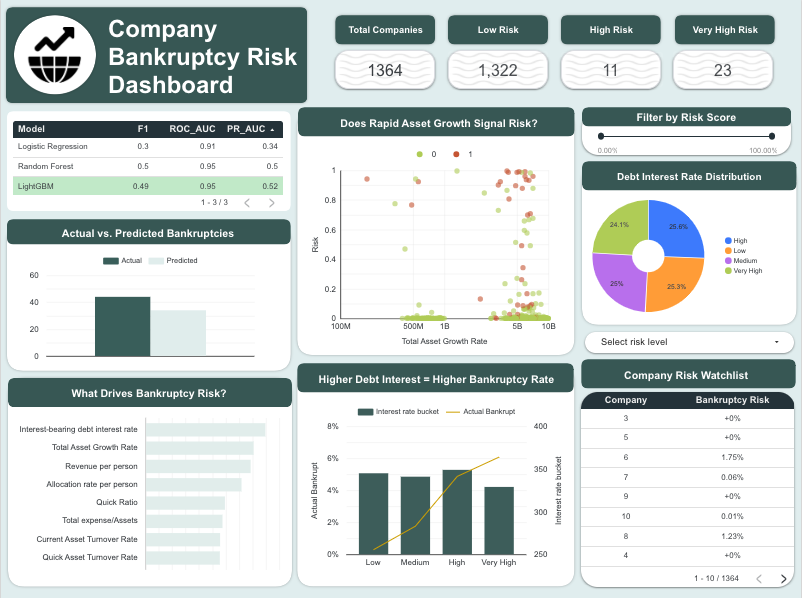

# Company Bankruptcy Prediction

An end-to-end machine learning pipeline predicting company bankruptcy using financial ratios, with results visualized in an interactive Looker Studio dashboard.

## Overview

- **Dataset**: [Taiwan Economic Journal company bankruptcy data (1999–2009)](https://www.kaggle.com/datasets/fedesoriano/company-bankruptcy-prediction), via Kaggle
- **Problem type**: Binary classification, heavily imbalanced (3% of companies went bankrupt)
- **Goal**: Predict bankruptcy risk from ~95 financial ratios, and communicate results in a business-friendly dashboard
  

## Pipeline

1. **EDA** — class imbalance check, correlation analysis, distribution/outlier inspection
2. **Preprocessing** — outlier capping (winsorization), train/test split, scaling, SMOTE (train set only)
3. **Modeling** — Logistic Regression, Random Forest, and LightGBM, compared on ROC-AUC, PR-AUC, and F1
4. **Evaluation** — confusion matrices, ROC/PR curves, threshold tuning
5. **Feature importance** — LightGBM split-gain importance
6. **Export** — predictions and feature importances exported for dashboarding

## Results

| Model | ROC-AUC | PR-AUC | F1 |
|---|---|---|---|
| Logistic Regression | 0.911 | 0.341 | 0.30 |
| Random Forest | 0.948 | 0.498 | 0.50 |
| **LightGBM** | **0.949** | **0.521** | 0.49 |

Given the 3% class imbalance, **PR-AUC** is the more informative metric — LightGBM was the strongest model here.

Top predictive features: interest-bearing debt interest rate, total asset growth rate, revenue per person, quick ratio — leverage, liquidity, and efficiency ratios dominate over raw profitability measures.

## Dashboard

An interactive Looker Studio dashboard was built on top of the model's exported predictions, including:
- Model comparison table
- Feature importance
- Risk-bucket segmentation
- A filterable company risk watchlist

*(Add your published Looker Studio share link here once available.)*

## Files

- `bankruptcy_prediction.ipynb` — full notebook (EDA → preprocessing → modeling → evaluation → export)

## Tech stack

Python, pandas, scikit-learn, LightGBM, imbalanced-learn (SMOTE), matplotlib/seaborn, Google Colab, Looker Studio

## Notes / caveats

- Several financial ratio columns contained extreme outlier values, in some cases likely due to data quality/scaling issues rather than genuine signal (see notebook for a specific investigation of the `Interest-bearing debt interest rate` column).
- Outliers were handled via capping (winsorization at the 1st/99th percentile) rather than row removal, to avoid disproportionately dropping the already-rare bankrupt companies.
